# 1.论文背景
## 1.1 背景介绍
这篇论文的研究背景聚焦于酶动力学参数预测在生物技术和工业应用中的重要性及其当前面临的挑战。酶的动力学参数，如$k_{cat}$、$k_{m}$以$k_{cat}$ / $k_{m}$，对于理解酶如何催化特定底物的反应至关重要，并直接影响到酶在代谢工程、合成生物学等领域中的应用效果。然而，实验测定这些参数的方法耗时、昂贵且劳动密集，导致目前可用的动力学参数数据库规模较小，与庞大的蛋白质序列数据库相比显得尤为不足，这严重限制了下游应用的发展，例如定向进化和代谢工程。

尽管研究人员尝试利用计算方法来加速酶动力学参数的预测过程，但现有工具往往专注于单一任务，未能充分捕捉$k_{cat}$和$k_{m}$之间的关系，也未考虑到诸如pH值和温度等环境因素对酶活性的影响。此外，由于数据集的不平衡问题，现有的模型在处理高价值预测任务时表现不佳。这些问题的存在，使得当前的预测工具难以满足实际应用的需求，特别是在酶发现和定向进化方面。

面对这些挑战，研究者们提出了基于深度学习技术的新解决方案。特别是自然语言处理领域的无监督学习进展，为蛋白质和小分子的数据表示提供了新的途径，从而为开发更加有效的酶动力学参数预测模型指明了方向。为了克服现有模型的局限性，本文介绍了一种名为UniKP的基于预训练语言模型的统一框架，该框架能够从给定的酶序列和底物结构中准确预测三种酶动力学参数。同时，还提出了一种考虑环境因素影响的两层框架EF-UniKP，旨在提高预测的准确性。通过一系列实验验证，展示了这两种框架在酶发现和定向进化任务中的有效性，为酶工程及其工业应用提供了新的视角和工具。
## 1.2 论文方法
[《UniKP: a unified framework for the prediction of enzyme kinetic parameters》](https://doi.org/10.1038/s41467-023-44113-1)
本文提出的方法如下：

- **基于预训练语言模型的框架（UniKP）**：利用深度学习领域特别是自然语言处理无监督学习的最新进展，开发了一个统一框架，用于从蛋白质序列和底物结构中预测三种关键的酶动力学参数（$k_{cat}$、$k_{m}$ 和 $k_{cat}$ / $k_{m}$），以提高预测准确性。
- **两层框架考虑环境因素（EF-UniKP）**：提出了一个两层框架，除了基础的动力学参数预测外，还特别考虑了环境因素如pH值和温度对酶活性的影响，从而在不同条件下提高了预测的准确性和实用性。
- **多种机器学习和深度学习模型比较**：对16种不同的机器学习模型和2种深度学习模型进行了全面评估与比较，展示了新提出的UniKP框架相对于现有方法的显著改进。
- **数据集重新加权技术的应用**：针对实验测量动力学参数分布不平衡的问题，应用了重新加权方法，通过增加代表性不足类别（高值动力学参数样本）的权重，有效减少了高值预测任务中的误差。
- **实际应用验证**：通过辅助酪氨酸氨解酶（TAL）的挖掘和定向进化，验证了UniKP和EF-UniKP框架的有效性。发现了具有显著增强$k_{cat}$值的TAL同源物，并确认了两种具有最高报道$k_{cat}$ / $k_{m}$值的TAL突变体，证明了该框架在识别高度活跃酶方面的潜力。

## 1.3 数据集介绍

论文的所有支持关键发现的相关数据均在文章及其补充信息文件中提供。论文分析的所有数据均可从公共数据库获取，包括[BRENDA](https://www.brenda-enzymes.org/search_result.php?a=305)、[UniProt](https://www.uniprot.org/)、[PubChem](https://pubchem.ncbi.nlm.nih.gov/))数据库或参考文献的补充数据集[DLKcat](https://github.com/SysBioChalmers/DLKcat), [KM_prediction](https://github.com/AlexanderKroll/KM_prediction)。论文描述的数据可在[UniKP](https://github.com/Luo-SynBioLab/UniKP)下载。数据也可在Zenodo获得：https://zenodo.org/records/10115498。实验数据集放置在datasets文件夹中。

## 1.4 pipeline

本作业将基于论文[官方代码仓库](https://github.com/Luo-SynBioLab/UniKP)实现，将pytorch版本的网络模型转换成mindspore版本的模型。

# 2.mindspore实现版本

代码仓库：https://github.com/upupoo999/UniKP_mindspore.git

## 2.1 mindspore框架介绍

MindSpore是华为推出的一款人工智能计算框架，主要用于开发AI应用和模型。它的特点如下:

- 框架设计：MindSpore采用静态计算图设计，PyTorch采用动态计算图设计。静态计算图在模型编译时确定计算过程，动态计算图在运行时确定计算过程。静态计算图通常更高效，动态计算图更灵活；
- 设备支持：MindSpore在云端和边缘端都有较好的支持，可以在Ascend、CPU、GPU等硬件上运行；
- 自动微分：MindSpore提供自动微分功能，可以自动求导数，简化模型训练过程；
- 运算符和层：MindSpore提供丰富的神经网络层和运算符，覆盖CNN、RNN、GAN等多种模型；
- 训练和部署：MindSpore提供方便的模型训练和部署功能，支持ONNX、CANN和MindSpore格式的模型导出，可以部署到Ascend、GPU、CPU等硬件；

## 2.2 环境准备

操作系统Ubuntu 20.04，CUDA 11.6

创建虚拟环境并且切换到环境：

```cmd
conda create -n unikp python=3.9
conda activate unikp
```

克隆已经实现好的mindspore版本unikp代码：

```
git clone https://github.com/upupoo999/UniKP_mindspore.git
```

下载依赖包：

```cmd
 pip install https://ms-release.obs.cn-north-4.myhuaweicloud.com/2.2.14/MindSpore/unified/x86_64/mindspore-2.2.14-cp39-cp39-linux_x86_64.whl --trusted-host ms-release.obs.cn-north-4.myhuaweicloud.com
 pip install mindnlp==0.4.1
 conda install scikit-learn
```

## 2.3 模型迁移

将Pytorch的API替换成mindspore的API，官方给出了[文档说明](https://www.mindspore.cn/docs/zh-CN/r2.2/note/api_mapping/pytorch_api_mapping.html)。

## 2.4 详细迁移代码

### 网络实现

Unikp的架构如下图所示：

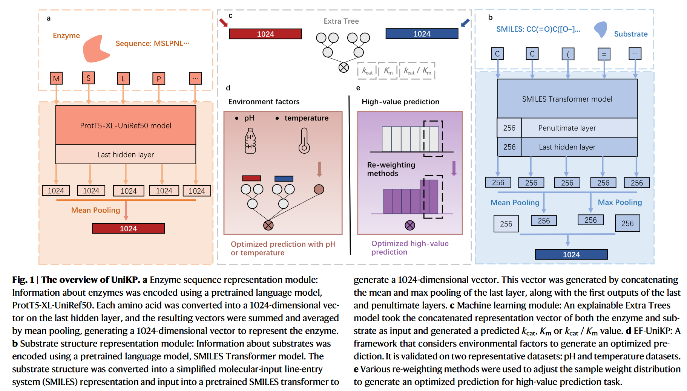

ProtT5-XL-UniRef50模型使用mindnlp库仿照huggingface的transformers库加载。

Extra tree模型使用sklearn库中模型。

预训练的SMILES Transformer model的mindspore实现版本如下：

```python
import argparse
import math
import os

import numpy as np
import mindspore.nn as nn
import mindspore.ops as ops
from mindspore import Tensor
import mindspore
from mindspore import dtype as mstype


PAD = 0
UNK = 1
EOS = 2
SOS = 3
MASK = 4

class PositionalEncoding(nn.Cell):
    "Implement the PE function. No batch support?"
    def __init__(self, d_model, dropout, max_len=5000):
        super().__init__()
        self.dropout = nn.Dropout(p=dropout)

        # Compute positional encodings once in log space.
        pe = ops.zeros((max_len, d_model), dtype=mstype.float32)
        position = ops.arange(0, max_len).unsqueeze(1)
        div_term = ops.exp(ops.arange(0, d_model, 2) * -(math.log(10000.0) / d_model))
        pe[:, 0::2] = ops.sin(position * div_term)
        pe[:, 1::2] = ops.cos(position * div_term)
        self.pe = Tensor(pe.unsqueeze(0))

    def construct(self, x):
        # x: (B, T, H)
        x = x + self.pe[:, :x.shape[1], :]
        return self.dropout(x)
    

class TrfmSeq2seq(nn.Cell):
    def __init__(self, in_size, hidden_size, out_size, n_layers, dropout=0.1):
        super().__init__()
        self.in_size = in_size
        self.hidden_size = hidden_size
        self.embed = nn.Embedding(in_size, hidden_size)
        self.pe = PositionalEncoding(hidden_size, dropout)
        self.trfm = nn.Transformer(
            d_model=hidden_size,
            nhead=4,
            num_encoder_layers=n_layers,
            num_decoder_layers=n_layers,
            dim_feedforward=hidden_size
        )
        self.out = nn.Dense(hidden_size, out_size)

    def construct(self, src):
        # src: (T, B)
        embedded = self.embed(src)  # (T, B, H)
        embedded = self.pe(embedded)  # (T, B, H)
        hidden = self.trfm(embedded, embedded)  # (T, B, H)
        out = self.out(hidden)  # (T, B, V)
        out = ops.log_softmax(out, axis=2)  # (T, B, V)
        return out  # (T, B, V)

    def _encode(self, src):
        # src: (T, B)
        embedded = self.embed(src)  # (T, B, H)
        embedded = self.pe(embedded)  # (T, B, H)
        output = embedded
        encoder_layers = self.trfm.encoder.layers
        for i in range(len(encoder_layers) - 1):
            output = encoder_layers[i](output, None)  # (T, B, H)
        penul = output.asnumpy()
        output = encoder_layers[-1](output, None)  # (T, B, H)
        if self.trfm.encoder.norm is not None:
            output = self.trfm.encoder.norm(output)  # (T, B, H)
        output = output.asnumpy()
        # mean, max, first*2
        return np.hstack([
            np.mean(output, axis=0),
            np.max(output, axis=0),
            output[0, :, :],  # (B, H)
            penul[0, :, :]   # (B, H)
        ])  # (B, 4H)

    def encode(self, src):
        # src: (T, B)
        batch_size = src.shape[1]
        if batch_size <= 100:
            return self._encode(src)
        else:
            print('There are {:d} molecules. It will take a little time.'.format(batch_size))
            st, ed = 0, 100
            out = self._encode(src[:, st:ed])  # (B, 4H)
            while ed < batch_size:
                st += 100
                ed += 100
                out = np.concatenate([out, self._encode(src[:, st:ed])], axis=0)
            return out
```

### 权重迁移

预训练的SMILES Transformer model的权重迁移将pytorch版本的网络参数对与mindspore版本的网络参数对做映射后使用mindspore的Parameter类进行封装，再保存起来，迁移后存在一定程度的误差。代码实现详细见./code/pt_to_ms.py文件，模型网络参数对与映射见./model_map文件夹。

## 2.5 实现结果

### Unikp预测$k_{cat}$

Unikp框架预测$k_{cat}$的代码文件详见./code/UniKP_kcat.py，结果文件详见./PreKcat_new文件夹，实验结果指标如下：

```cmd
***The whole set***
Pcc: 0.9829548881578469 RMSE: 0.27606632370125334 MAE: 0.058252684357157615 r2: 0.9661897609456886
***Test set***
Pcc: 0.815962207828316 RMSE: 0.8650910508781682 MAE: 0.5765287524139132 r2: 0.6645914290485185
***The whole wildtype set***
Pcc: 0.97608707290521 RMSE: 0.31273098731007865 MAE: 0.0684321702020414 r2: 0.9525910836088913
***The test wildtype set***
Pcc: 0.7292384486141315 RMSE: 0.9748373214142211 MAE: 0.6721025632980724 r2: 0.5158847926715447
***The whole mutant set***
Pcc: 0.9892097921616105 RMSE: 0.22103770815098142 MAE: 0.04535391752179996 r2: 0.9784669483569125
***The test mutant set***
Pcc: 0.8923789643888222 RMSE: 0.6996756821842572 MAE: 0.4540181493022402 r2: 0.7887563948206212
***The Test new_substrate_enzyme dataset***
Pcc: 0.7711965447431852 RMSE: 1.0315118289532146 MAE: 0.6898741519153144 r2: 0.5914227241953518
```

一些论文中的复现图如下：

**average coefficient of determination (R2) value for UniKP after five rounds of random test set splitting**

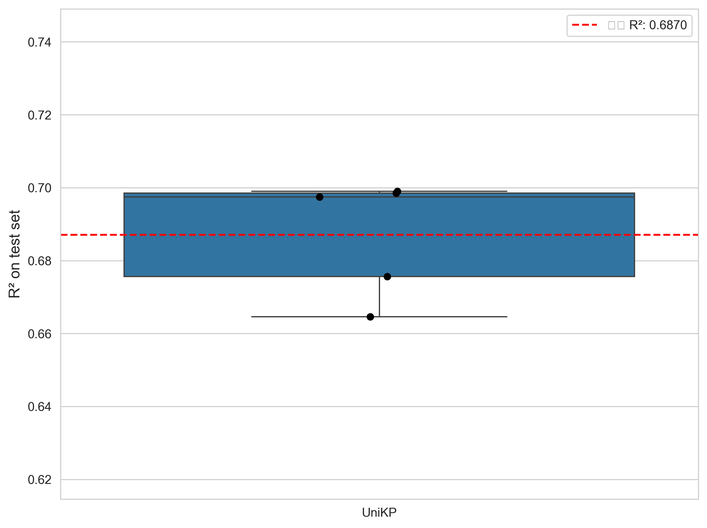

**the root mean square error (RMSE) between experimentally measured $k_{cat}$ values and predicted $k_{cat}$ values of  UniKP for training and test sets.**

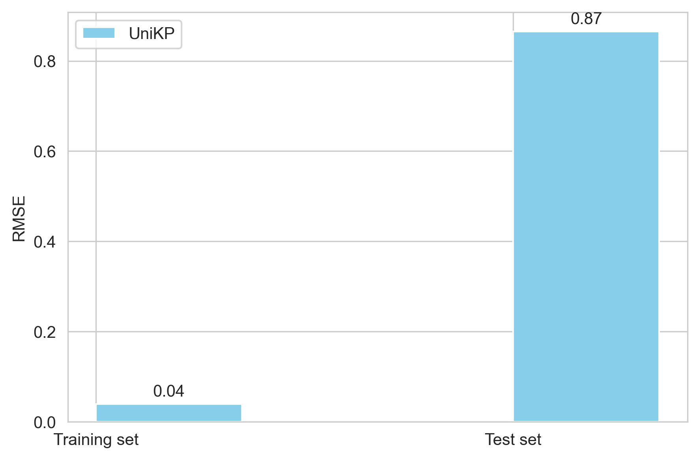

**Scatter plot illustrating the Pearson coefficient correlation (PCC) between experimentally measured $k_{cat}$ values and predicted $k_{cat}$ values of UniKP for the test set, showing a strong linear correlation. The color gradient represents the density of data points, ranging from blue to red.**

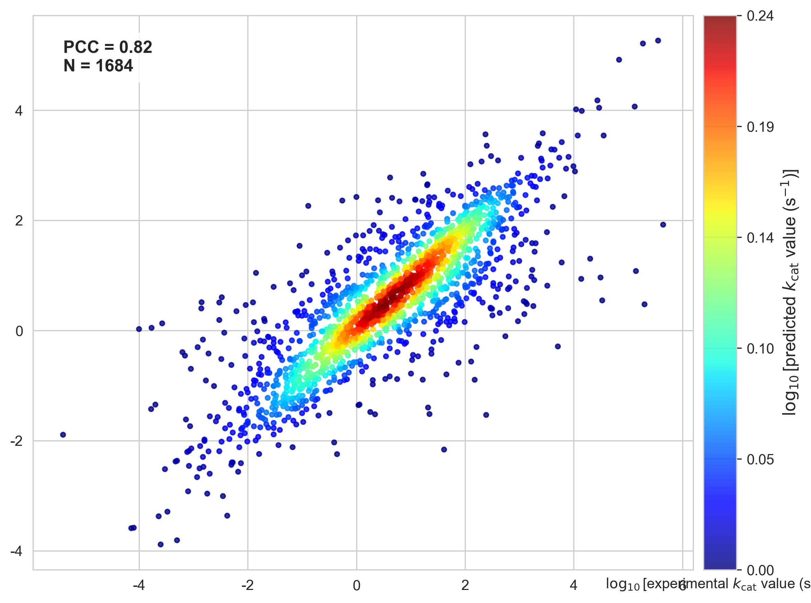

**$k_{cat}$ values and predicted $k_{cat}$ values of DLKcat and UniKP in various experimental $k_{cat}$ numerical intervals.** 

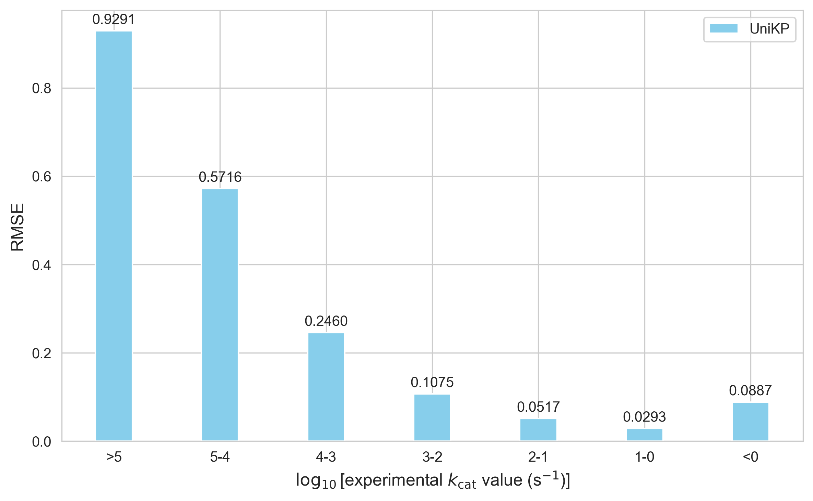

**UniKP markedly discriminates $k_{cat}$ values of enzymes and their mutants. Scatter plot illustrating the Pearson coefficient correlation (PCC) between experimentally measured $k_{cat}$ values and predicted $k_{cat}$ values of UniKP for wild type enzymes (a) and mutated enzymes (b). The color gradient  represents the density of data points, ranging from blue to red. (c) PCC values of wild-type and mutated enzymes on the test set of UniKP.** 

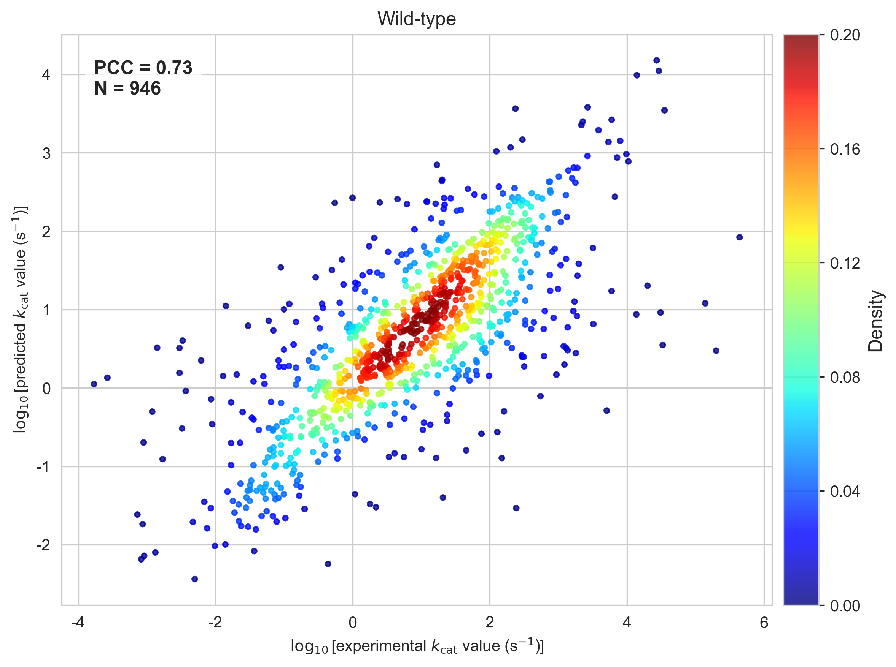

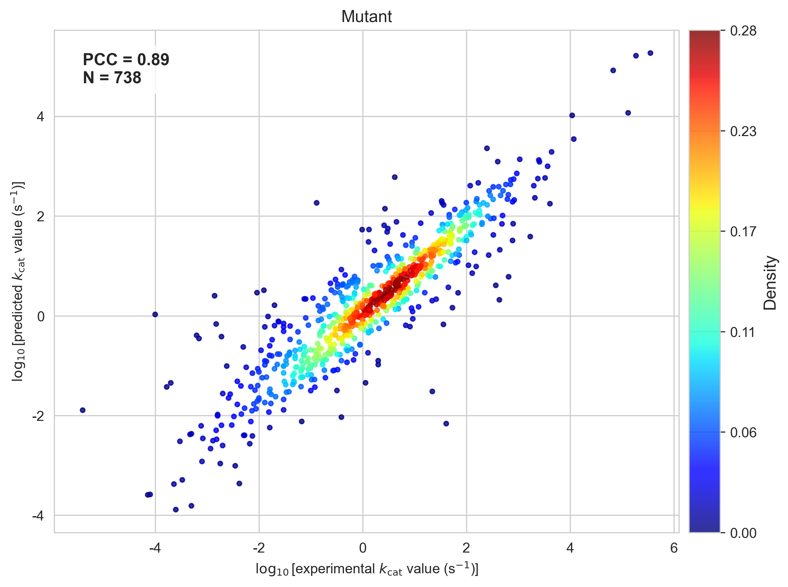

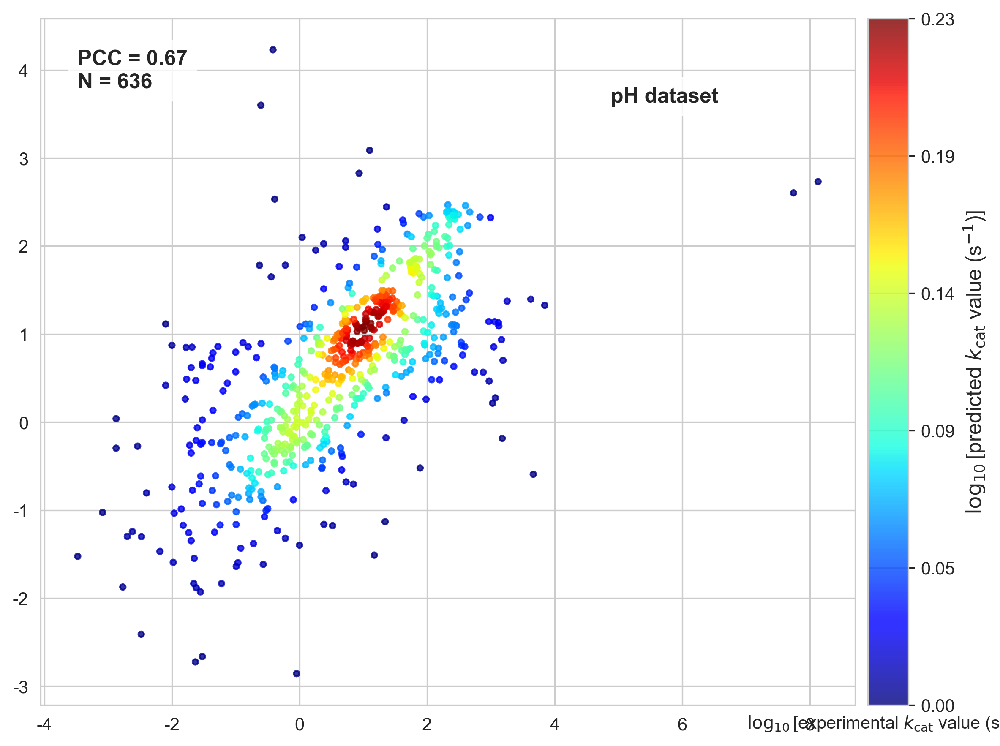


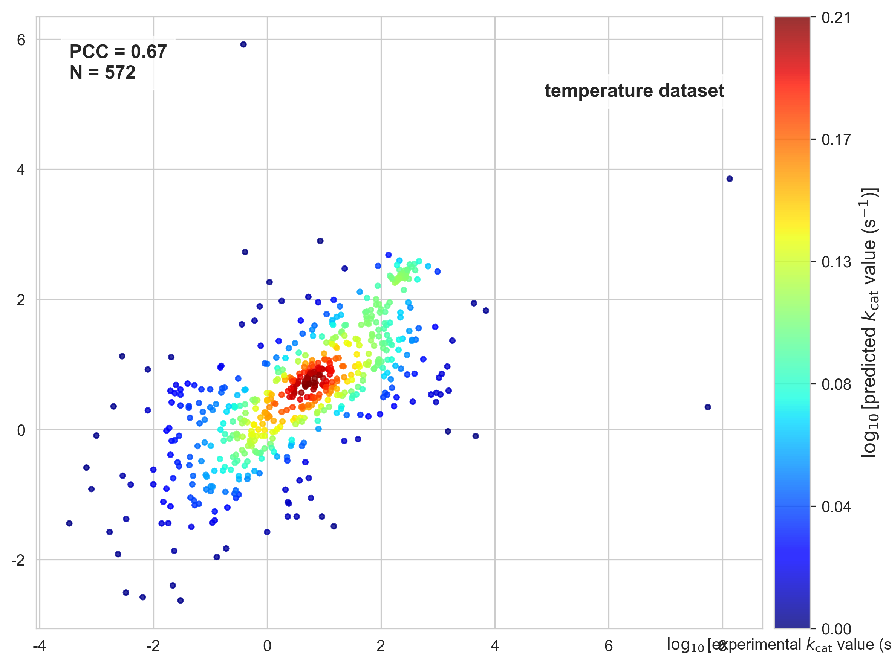

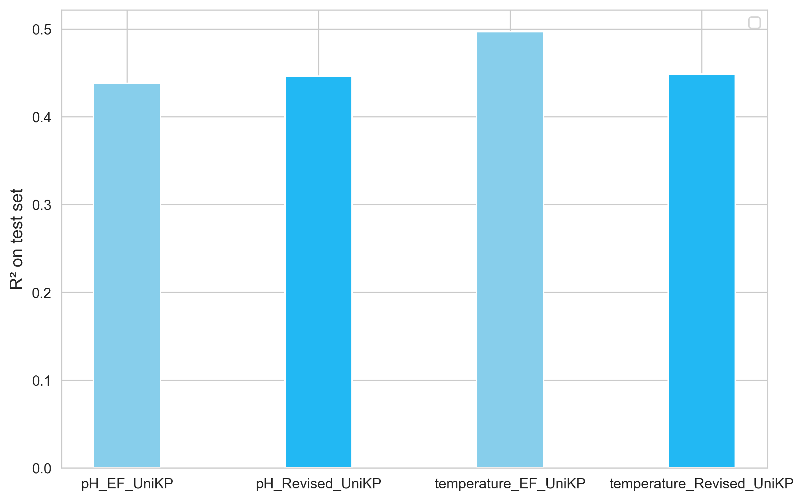

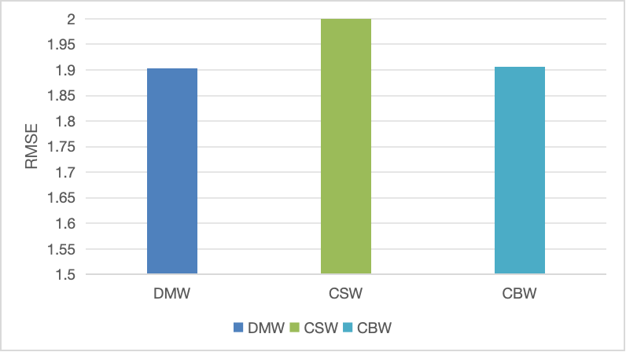